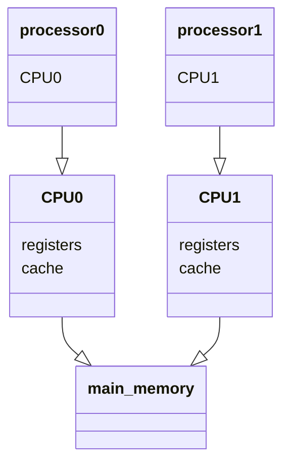
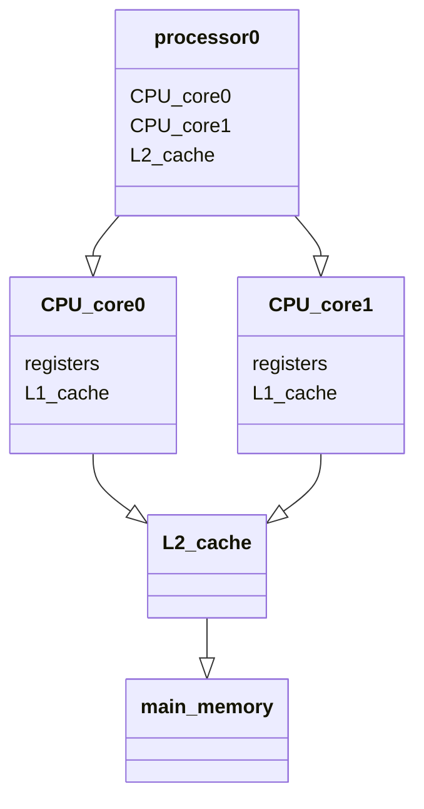
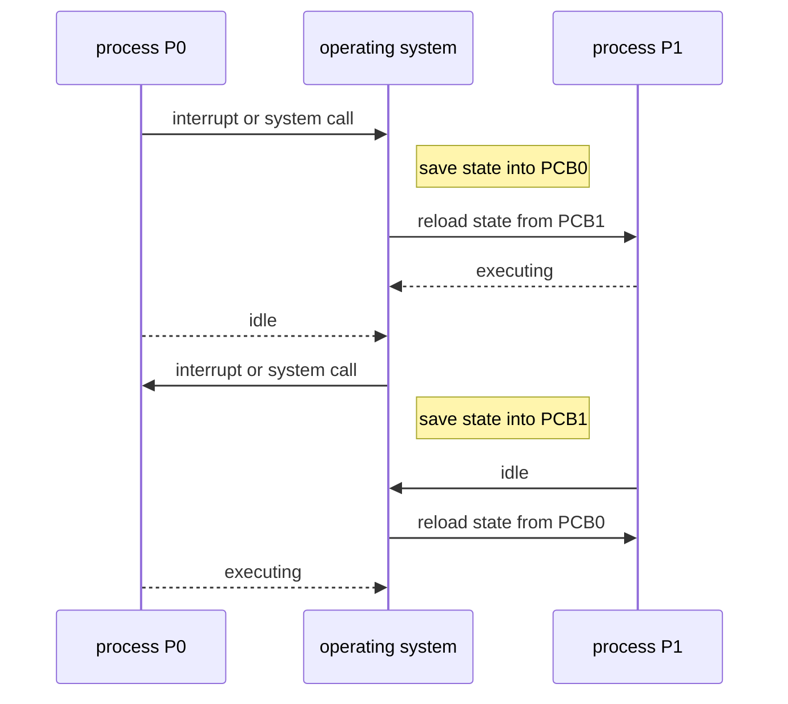
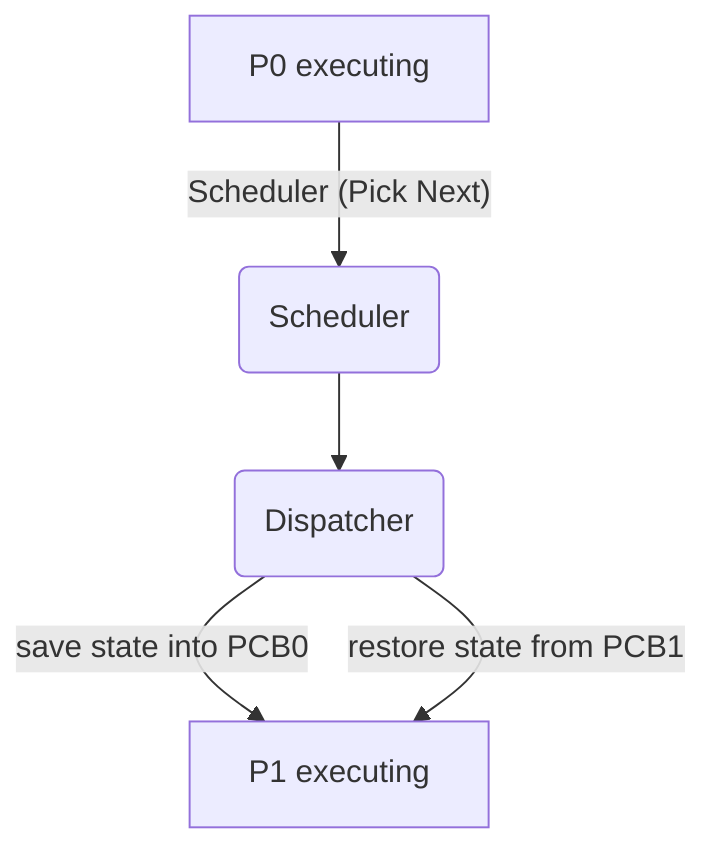

# Contents
- [[#The Kernel|The Kernel]]
- [[#Devices|Devices]]
	- [[#Devices#Interrupts|Interrupts]]
- [[#An aside on Storage Structure|An aside on Storage Structure]]
- [[#Direct Memory Access (DMA)|Direct Memory Access (DMA)]]
- [[#Multiprocessor systems|Multiprocessor systems]]
	- [[#Multiprocessor systems#Non-Uniform Memory Access (NUMA) Systems|Non-Uniform Memory Access (NUMA) Systems]]
- [[#Multi-programming|Multi-programming]]
- [[#Resource manangement|Resource manangement]]
- [[#How are syscalls used?|How are syscalls used?]]
- [[#How does a syscall *actually* work?|How does a syscall *actually* work?]]
- [[#Subsystems|Subsystems]]
- [[#Kernel Structures|Kernel Structures]]
	- [[#Kernel Structures#Monolithic Kernel|Monolithic Kernel]]
	- [[#Kernel Structures#Layered Kernels|Layered Kernels]]
	- [[#Kernel Structures#Microkernel|Microkernel]]
	- [[#Kernel Structures#Modular Kernels|Modular Kernels]]
	- [[#Kernel Structures#Hybrid Kernels|Hybrid Kernels]]
- [[#PCI|PCI]]
- [[#I/O Address ranges|I/O Address ranges]]
- [[#Memory-mapped I/O|Memory-mapped I/O]]
- [[#I/O device control registers|I/O device control registers]]
- [[#Polling|Polling]]
- [[#Process Control Block (PCB)|Process Control Block (PCB)]]
- [[#Process [[#Scheduling]]|Process [[#Scheduling]]]]
	- [[#Process [[#Scheduling]]#Context Switching|Context Switching]]
	- [[#Process [[#Scheduling]]#An aside on `fork()`ing|An aside on `fork()`ing]]
- [[#Inter-process Communication|Inter-process Communication]]
	- [[#Inter-process Communication#Shared Memory|Shared Memory]]
	- [[#Inter-process Communication#Message Passing|Message Passing]]
		- [[#Message Passing#Signals|Signals]]
- [[#Models of multi-threading|Models of multi-threading]]
- [[#Issues with threading|Issues with threading]]
	- [[#Issues with threading#`fork()` and `exec()`|`fork()` and `exec()`]]
	- [[#Issues with threading#Handling [[#Signals]]|Handling [[#Signals]]]]
	- [[#Issues with threading#Cancelling Threads|Cancelling Threads]]
	- [[#Issues with threading#Thread-Local Storage|Thread-Local Storage]]
- [[#Thread Control Blocks (TCBs)|Thread Control Blocks (TCBs)]]
- [[#Process and Thread Behaviour|Process and Thread Behaviour]]
- [[#Goals of Scheduling|Goals of Scheduling]]
	- [[#Goals of Scheduling#Performance|Performance]]
	- [[#Goals of Scheduling#Fairness|Fairness]]
- [[#Classes of Schedulers|Classes of Schedulers]]
	- [[#Classes of Schedulers#Batch|Batch]]
	- [[#Classes of Schedulers#Interactive|Interactive]]
- [[#Real-time|Real-time]]
- [[#Types of Scheduling|Types of Scheduling]]
	- [[#Types of Scheduling#Non-preemptive|Non-preemptive]]
	- [[#Types of Scheduling#Preemptive|Preemptive]]
- [[#Algorithms|Algorithms]]
	- [[#Algorithms#First-come First-served (FCFS)|First-come First-served (FCFS)]]
	- [[#Algorithms#Shortest Job First (SJF)|Shortest Job First (SJF)]]
	- [[#Algorithms#Round-Robin (RR)|Round-Robin (RR)]]
	- [[#Algorithms#Priority (PRIO)|Priority (PRIO)]]
	- [[#Algorithms#Multiple Queues (MQ)|Multiple Queues (MQ)]]
	- [[#Algorithms#Multilevel Feedback Queue (MLFQ)|Multilevel Feedback Queue (MLFQ)]]
- [[#Logical Address Spaces vs. Physical Address Spaces|Logical Address Spaces vs. Physical Address Spaces]]
- [[#Dynamic Loading and Dynamically Linked Libraries (DLLs)|Dynamic Loading and Dynamically Linked Libraries (DLLs)]]
- [[#Contiguous Memory Allocation|Contiguous Memory Allocation]]
- [[#Translation Look-aside Buffer (TLB)|Translation Look-aside Buffer (TLB)]]
- [[#Benefits of Paging|Benefits of Paging]]
	- [[#Benefits of Paging#Shared Pages|Shared Pages]]
	- [[#Benefits of Paging#Read-only code pages|Read-only code pages]]
- [[#Page Table Structures|Page Table Structures]]
	- [[#Page Table Structures#Hierarchical paging|Hierarchical paging]]
	- [[#Page Table Structures#Hashed Page Tables|Hashed Page Tables]]
	- [[#Page Table Structures#Inverted Page Tables|Inverted Page Tables]]
- [[#Swapping|Swapping]]
- [[#Page Fault|Page Fault]]
- [[#Page Replacement|Page Replacement]]
	- [[#Page Replacement#FIFO Page Replacement|FIFO Page Replacement]]
		- [[#FIFO Page Replacement#Belady's Anomaly|Belady's Anomaly]]
	- [[#Page Replacement#Optimal Page Replacement|Optimal Page Replacement]]
	- [[#Page Replacement#Least Recently Used (LRU) Page Replacement|Least Recently Used (LRU) Page Replacement]]
	- [[#Page Replacement#Second Chance Page Replacement|Second Chance Page Replacement]]
		- [[#Second Chance Page Replacement#Enhanced Second Choice|Enhanced Second Choice]]
	- [[#Page Replacement#Counting-Based Page Replacement|Counting-Based Page Replacement]]
- [[#Thrashing|Thrashing]]
	- [[#Thrashing#Cause of thrashing|Cause of thrashing]]
- [[#Working Set|Working Set]]
- [[#Kernel Memory Allocation|Kernel Memory Allocation]]
	- [[#Kernel Memory Allocation#Buddy System|Buddy System]]
	- [[#Kernel Memory Allocation#Slab Allocation|Slab Allocation]]
- [[#Hard Disk Drives (HDDs)|Hard Disk Drives (HDDs)]]
	- [[#Hard Disk Drives (HDDs)#HDD Scheduling|HDD Scheduling]]
		- [[#HDD Scheduling#FCFS Scheduling|FCFS Scheduling]]
		- [[#HDD Scheduling#SSTF Scheduling|SSTF Scheduling]]
		- [[#HDD Scheduling#SCAN Scheduling|SCAN Scheduling]]
			- [[#SCAN Scheduling#C-SCAN|C-SCAN]]
- [[#NonVolatile Memory (NVM) devices|NonVolatile Memory (NVM) devices]]
	- [[#NonVolatile Memory (NVM) devices#`NAND` Flash Controller Algorithms|`NAND` Flash Controller Algorithms]]
	- [[#NonVolatile Memory (NVM) devices#NVM Scheduling|NVM Scheduling]]
- [[#Error Detection and Correction|Error Detection and Correction]]
- [[#Storage Device Management|Storage Device Management]]
	- [[#Storage Device Management#Formatting|Formatting]]
	- [[#Storage Device Management#Partition|Partition]]
- [[#RAID|RAID]]
	- [[#RAID#RAID Levels|RAID Levels]]
- [[#File|File]]
	- [[#File#Access Methods|Access Methods]]
- [[#Directory|Directory]]
- [[#Memory-Mapped files|Memory-Mapped files]]
- [[#File system structure|File system structure]]
- [[#How [[#Directory|directories]] are actually implemented|How [[#Directory|directories]] are actually implemented]]
	- [[#How [[#Directory|directories]] are actually implemented#Linear list|Linear list]]
	- [[#How [[#Directory|directories]] are actually implemented#Hash Table|Hash Table]]
- [[#Allocating disk space|Allocating disk space]]
	- [[#Allocating disk space#Contiguous allocation of files|Contiguous allocation of files]]
	- [[#Allocating disk space#Linked allocation of files|Linked allocation of files]]
	- [[#Allocating disk space#Indexed Allocation of files|Indexed Allocation of files]]
- [[#Deleting files|Deleting files]]
- [[#Recovering files|Recovering files]]
- [[#Race Conditions|Race Conditions]]
- [[#Critical Section|Critical Section]]
- [[#Preemptive kernel solution|Preemptive kernel solution]]
- [[#Hardware support|Hardware support]]
- [[#Mutex Locks|Mutex Locks]]
- [[#Semaphores|Semaphores]]
	- [[#Semaphores#How to synchronise with semaphores|How to synchronise with semaphores]]
- [[#Deadlocks|Deadlocks]]
- [[#Benefits and Features|Benefits and Features]]
- [[#Building a VM|Building a VM]]
	- [[#Building a VM#VCPU|VCPU]]
		- [[#VCPU#VMs executing [[#Privileges|privileged]] instructions|VMs executing [[#Privileges|privileged]] instructions]]
	- [[#Building a VM#Nested [[#Page Table Structures|Page Tables]]|Nested [[#Page Table Structures|Page Tables]]]]


# What is an Operating System? (Intro)
A *computer system* consists of the **hardware**, the **application programs** (apps), and the ***operating system*** (OS). The OS controls the hardware and coordinates its use among the various apps.
## The Kernel
While there are multiple definitions on *what* an operating system *actually is*, a common definition is that the OS is actually the **kernel** - a program running on the computer at all times. Other programs, such as the application programs ran by a user, will interact with this kernel to access the underlying hardware.
## Devices
For computers to provide functionality, they will need **devices** to communicate with the outside world. The OS supports these in the form of a ***device driver***; software that understands the device controller and provides an interface to the rest of the computer system. Devices are not just I/O - **storage controllers** are a form of device for the computer to access physical storage (like *disks*).
### Interrupts
As the time to complete tasks is dependent on many unpredictable factors, the device uses **interrupts** to inform the driver that an operation has finished. This is sent along the **system bus** (*the main communications path between components*).

When the CPU receives an interrupt, it stops its current task and transfers execution to the location the interrupt service resides. As interrupts occur often, a table (often called the **interrupt vector**) of pointers to these interrupt routines. OSes also have the architecture to store the current execution state, so that on completion of the interrupt, the CPU resumes its previous execution. If an interrupt were to modify this state in some way, it must still store the current state and resume had the interrupt not occurred.
![[Interrupt Execution Timeline.png]]
The CPU checks for interrupts (on an *interrupt request line*) between executing every instruction.

Most CPUs will have two interrupt request lines: a **maskable** and **non-maskable** one. Most device controllers will *assert their interrupts* to the maskable line, which can be ignored by the CPU before the execution of critical instruction sequences that must not be interrupted. Non-maskable interrupts are reserved for "catastrophic" memory errors, such as unrecoverable memory errors and other forms of massive irretrievable data loss. Computers may also use *interrupt chaining* to point to lists of many interrupt vectors if they have many devices.
## An aside on Storage Structure
When we talk about "memory" on a computer, this can refer to a variety of actual storage mediums. All of the following could be referred to as "memory":

| **Name**          | **Storage Tier** | **Volatility** |
| ----------------- | ---------------- | -------------- |
| Registers         | *Primary*        | *Volatile*     |
| Cache             | *Primary*        | *Volatile*     |
| Main memory (RAM) | *Secondary*      | *Volatile*     |
| Hard Disk Drives  | *Secondary*      | *Non-volatile* |
| Optical Disks     | *Tertiary*       | *Non-volatile* |
| Magnetic Tapes    | *Tertiary*       | *Non-volatile* |

The further down this list we get, the storage capacity gets larger, and the memory access time also gets slower.
## Direct Memory Access (DMA)
We can't simply use [[#Interrupts]] for bulk data transfer as they have a lot of overhead. **DMA** is used to solve this: after setting up all the buffers/pointers/etc for the device controller, DMA transfers an entire block of data directly to the device with *no CPU intervention*.
## Multiprocessor systems
Many computers these days have moved away from having a single *processor* (core/processing unit/CPU/whatever you want to call it) and now utilise **multiple processors**. This is commonly implemented *symmetrically* - all processors perform all tasks.



This is slightly different from a <i>multi<b>core</b></i> system in which actual *cores* are located on the same processor. The main difference here is the addition of a secondary cache for all cores to use.

### Non-Uniform Memory Access (NUMA) Systems
[[#Multiprocessor systems]] don't intuitively scale with more cores as the *system bus* becomes the major bottleneck. NUMA solves this by connecting all CPUs with a *shared system interconnect*, making them all share the same physical address space. This allows all CPUs to access memory in parallel without contention.

![[NUMA system architecture.png]]
## Multi-programming
The fact that users typically *want* to run more than one program at a time, and that it would be inefficient to leave the CPU or I/O devices idle for long periods of time. The OS achieves this with **multi-programming**. It keeps multiple programs being executed (*processes*) in memory at once, and then picks one of these processes to execute. If this active process has to wait (e.g. for an I/O [[#Devices|device]]), then the CPU *switches to another process* while it waits, returning once done.
**Multitasking** is an extension of multi-programming where this switching happens so fast a user is led to believe the programs are executing in parallel.
# Privileges
The OS's [[#The Kernel|kernel]] also provides security and abstraction benefits. It allows application program developers to avoid worrying about how to interact with the hardware, instead making them focus on how to interact with the *kernel* instead. This also acts as a security against malicious code, as the kernel checks how applications make requests for hardware resources.
An architecture that wishes to support privileges must support *atleast two modes*: ***kernel*** mode and ***user*** mode. For example, the `x86` architecture supports 4 protection modes.
![[x86 Privileges (Rings).png]]
This gives the more user-accessible applications less kernel instructions it can execute. If an application wants to do something privileged (i.e. *read from storage*) it must perform a [[#Syscalls|syscall]].
# Syscalls
System calls (`syscalls`) provide an interface to kernel mode instructions for lesser privileged programs. Syscalls usually come in one of six categories:
- process control
- file management
- device management
- information maintenance
- communications
- protection
## How are syscalls used?
The OS usually provides an *Application Programming Interface* (API) which supplies all the syscalls an application (user-space program) can use. These syscalls will often take **parameters** (for example, if we wanted to `open()` a file, *what file* do we want to actually open?) These parameters are passed into a register, and when the OS switches to kernel mode to actually perform the operation, it will read from this register to execute the desired operation.
## How does a syscall *actually* work?
When a CPU (core) receives a syscall instruction, it will
1. Save the current *Program Counter* (PC)
	- The control state, registers, and other necessary information is also saved.
2. Set the current *execution mode* to *privileged* (**kernel**)
3. Set the PC to a *`syscall` handler address*

It will then read any necessary parameters and execute the code related to that syscall, before returning to **user** mode and resuming the program from there (using the saved processor information as mentioned earlier).
![[How does a syscall actually work.png]]
# OS Structure
## Subsystems
When designing an OS, we must consider interactions between *subsystem services*, operating on a level between [[#The Kernel]] and the user-space programs (**importantly, these programs operate *outside* of the kernel**). Some of these are interfaces for [[#Syscalls]], but generally these fall into the following categories (*not to be confused with the categories of syscalls mentioned above*):
- **File management** ^00943e
	- Programs that create/delete/copy/rename/print/list/generally access and manipulate files/directories of files
		- *Directories are technically files too, but this will be covered later*
- **Status information**
	- Programs that ask the system for information. Simple examples may be the data/time, currently available memory, or the number of users. More complex information, such as verbose logging, may also be requested.
- **File modification**
	- Not to be confused with [[#^00943e|File management]], these programs access and manipulate **the *content* of files**. For example, a program may want to search the contents of a file for a given word (e.g. `grep`)
- **Programming language support**
	- While users can download the compilers/assemblers/debuggers for any language they desire, common languages (such as `C`, `C++`, `Java`, `Python`) can come prepackaged with the OS.
- **Program loading and execution**
	- Necessary programs to actually *run* user-space applications. Examples would be loaders and linkers (which I don't believe are covered on this course? just know they're needed for some programs to execute)
- **Communications**
	- This includes both communicating between *processes on the same system* and between *other computer systems entirely*. This may include sending messages (e.g. email), logging in remotely (e.g. `ssh`), and transferring files.
- **Background services**
	- Often known as *services* or *daemons*, these are constantly running in the background - whenever execution is not focused on anything direct (a form of [[#Multi-programming]]).

## Kernel Structures
When deciding how to fit all these services together, we must decide what our *goals* are. No structure will satisfy everyone, and come with their own benefits and drawbacks. For example, compare *MacOS* and *Linux*. Linux only enforces rules in it's kernel; it's up to developers to create their own user-accessible environment (*distro*). As a result, two computers both running Linux can look (and possibly operate) very differently. On the other hand, *MacOS* enforces rules all the way to the desktop environment, meaning that two people's Macbooks will operate (and likely look) very similar.
### Monolithic Kernel
The simplest method of structuring an OS is, simply, not structuring it. All functionality is put into a single file which runs in a single address space. This is called a **monolithic** kernel, and is what the original UNIX implementation uses.
![[Traditional UNIX System Structure.png]]
The major advantage of monolithic kernels is that the cost of [[#Subsystems]] talking to each other is very low. However, monolithic kernels are massive and therefore difficult to understand and modify. Also, due to the lack of isolation between the services, they're a bit unreliable (compared to other kernels) and are difficult to debug or maintain. 
Monolithic approaches are usually referred to as **tightly coupled** systems, which is a practise software engineers like to *avoid if possible*!
### Layered Kernels
Aiming to solve the tight-coupling problems of the [[#Monolithic Kernel]] through designing a **loosely coupled** system, Layered kernels act in a similar method to [[#Privileges]] (namely the rings in `x86`), in which layers closer to the hardware provide interfaces for those layers closer to what a user can interact with.
Any layer will use the services provided to it (through an interface) of the lower layers. *Dijkstra* provided such the first example of such an OS with his annoyingly-confusingly named `THE` system:
5. **Job Managers** - layer that executes the user's programs
4. **Device Managers** - layer that handles the [[#Devices]] and provides [[#Interrupts|buffering]]
3. **Console Manager** - layer that implements *virtual consoles*
2. **Page Manager** - layer that implements and managers *virtual memory pages* for each process
1. **Kernel** - layer that implements a virtual processor for each process
0. **Hardware**
Advantages of this hierarchical structure are that debugging is much simpler, as we can isolate problems to certain layers (it'll never be a bug in a higher layer than where the error's occurring). However, in practise, this mentality that "lower layers would never need higher ones" is too limiting (for example, virtual memory would likely want some [[#An aside on Storage Structure|real secondary storage]] to handle backup files). Also, this design comes with *insane* overhead if we need to commonly cross layers (which subsystem interaction likely will do **all the time**).
### Microkernel
The idea of a microkernel is to put *only what is necessary* into the kernel. Anything else is implemented as a user-space program. Typically, only minimal process and memory management are implemented in the kernel.
![[Typical Microkernel Architecture.png]]
However, if services (now living in user-space) need to talk to each other, this must be down via the kernel.
The advantages of a micro-kernel are that it is much smaller, and therefore more reliable and easier to maintain. It also allows for customisability since even basic services are swappable. Also, since these live in user-space, *extensions* can be easily created on that same layer.
However, microkernels still have poor performance due to the constant mode switching necessary.
### Modular Kernels
Modular kernels are not independent of any other kernels; they are more an idea to support extensions (and are a popular feature of *Linux*, which uses a [[#Monolithic Kernel]]). These modules can be loaded into the kernel and can communicate with previous services at boot or runtime. These modules can communicate with other modules through an interface; this does not add an overhead due to the linked nature of the kernel.
### Hybrid Kernels
We don't have to choose between *one* of the previous designs. Many modern OSes mix and match features of each design to try and get the benefits of all of kernel structures.
# I/O Subsystems
I/O devices (actually all devices, but we might as well just focus on I/O devices for this section) communicate with the main machine via a **port**. If the devices share a common set of wires (e.g. like on a motherboard connecting a storage drive) this connection is called a **bus**, and the messages sent to/from the device(s) are conveyed by patterns of timed electrical voltages. If Device 1 is plugged into Device 2 which is plugged into Device 3 which is connected to the computer, this is also a bus (known as a *daisy chain*).
## PCI
As buses are common in computer architecture, the *PCIe* standard is widely adopted. This bus connects the processor-memory subsystem to other fast devices (i.e [[#An aside on Storage Structure|secondary storage]]), and an *expansion bus* is used to connect to relatively slower devices. PCI is a multi-lane bus to allow simultaneous messages to be sent at once.
![[Typical PCI bus structure.png]]

PCI also has evolved through multiple generations; if we describe a device as having "<i>PCIe gen<b>3</b> x<b>8</b></i>" it means it is compatible with **third** generation PCIe and uses **eight** lanes. Like other [[#Devices]], PCIe does come with a *controller* in the form of a ***fibre channel** (FC)*. Due to PCI's (and other buses') complexity, this controller is often implemented as a separate circuit board that connects to a bus. Other devices, such as an SSD, also have a controller for the main unit.
![[SSD Controller.png]]
## I/O Address ranges
To transfer data over I/O, the device controller has some registers for data and control signals that the processor can read and write bit patterns into. These address ranges are usually reserved for specific devices:

| I/O address range (hexadecimal) | Device                |
|---------------------------------|-----------------------|
| 000–00F                         | DMA controller        |
| 020–021                         | interrupt controller  |
| 040–043                         | timer                 |
| 200–20F                         | game controller       |
| 2F8–2FF                         | serial port (secondary)|
| 320–32F                         | hard-disk controller  |
| 378–37F                         | parallel port         |
| 3D0–3DF                         | graphics controller   |
| 3F0–3F7                         | diskette-drive controller |
| 3F8–3FF                         | serial port (primary) |
## Memory-mapped I/O
An alternative I/O data transfer method to [[#I/O Address ranges]], memory-mapped I/O is the process of assigning these registers into the standard address space of the processor (e.g. not in any hard-coded specific place). To avoid applications overwriting this information with their own data, these ranges are usually outside the *actual physical address space* (think in the hundreds of terabytes on a 32GB system).
This is actually preferable to address ranges for massive data transfer, since writing millions of bytes to (e.g. graphics) device memory has significantly less overhead than issuing millions of I/O instructions (and even less so with [[#Direct Memory Access (DMA)|DMA]], which is only now [actually being used on modern graphics cards](https://developer.nvidia.com/blog/gpudirect-storage/)).
## I/O device control registers
I/O device controllers contain (usually) four registers, typically between 1-4 bytes in size. Some also have a *FIFO* chip that can hold several bytes of data beyond the size of the data register, until the device/host is able to receive the data.

| ***Register***      | ***What it do***                                                                                                                      |
| ------------------- | ------------------------------------------------------------------------------------------------------------------------------------- |
| *Data-in register*  | The host reads this to get input                                                                                                      |
| *Data-out register* | The host writes to this to send output                                                                                                |
| *Status register*   | Contains bits the host can read to indicate status (command completed, byte available in data-in, device error, etc)                  |
| *Control register*  | The host can write to this to change stuff on the device (e.g. enabling parity checking, changing word length, selecting speeds, etc) |
## Polling
Using these [[#I/O device control registers|registers]], if a host wants to communicate to a controller it must complete a basic handshaking procedure:
1. The host repeatedly writes `busy` into the *status* register until it becomes clear.
2. The host sets the `write` bit in the *status* register (*editor's note: book calls this the `command` register and refuses to elaborate. I'm assuming it means the **status** register*) and also writes a byte into the *data-out* register.
3. The host sets the `command-ready` bit in the *status* register.
4. The controller notices the `command-ready` bit is set and sets the `busy` bit.
5. The controller then sees the `write` bit from earlier (indicating *the host wishes to **write to** the device*) and performs the necessary I/O.
6. The controller clears the `command-ready`, `error` (this indicates the I/O succeeded), and `busy` (indicating I/O operation has finished) bits in the *status register*.

This is repeated for each byte.
*Polling* a device is done in three CPU instruction cycles:
1. **`read`** a device register
2. **`logical-and`** extract a status bit
3. **`branch`** if not zero

Polling becomes inefficient if it is attempted repeatedly to no avail, and this is when [[#Interrupts]] would be better used.

%% book goes into like 10 pages of more detail on interrupts here, but it seems superficial and non-examined %%

# Processes
A ***process*** is just an instance of a program *in execution*, a single flow of instructions. This means we can have multiple instances of a program at once, visualised as different processes. Only one process can run on a processor core at any instant.

When a program is executed (and a process is created), it's memory layout is divided into multiple sections:
![[Memory layout of a Process.png]]
- **Text** - the actual code to be executed
- **Data** - the (global) variables
- **Heap** - memory dynamically allocated during runtime
- **Stack** - memory used for temporary data storage required to invoked functions (local variables, return addresses, function parameters, etc)

It will be of note that the stack and heap *grow toward each other*; it's the responsibility of the OS to make sure these two don't overlap.
Processes can also be an environment for other code to execute in; the *JVM*, for example, is a process that interprets *Java* code and executes on behalf of that code. 

Each process has a *process ID* (`PID`), the namespace of which is *global* to the system to ensure only one process at a time has a specific `PID` (there are *some* exceptions like `cgroups`, but these aren't covered in the course so shhhh).
## Process Control Block (PCB)
The OS represents processes using a *process control block* (PCB) (also sometimes called a *task control block*). It contains many pieces of information associated with that process, including (but not limited to):

| ***Name***                   | ***Information provided***                                                                                          |
| ---------------------------- | ------------------------------------------------------------------------------------------------------------------- |
| *Process state*              | New/Ready/Running/Waiting/Halted                                                                                    |
| *Process number*             | `PID`                                                                                                               |
| *Program Counter*            | The address of the next instruction to be executed                                                                  |
| *Parent pointer*             | If the process was the result of a `fork()`, the PCB of the process that it was `fork()`ed from                     |
| *List of children*           | If the process `fork()`s, the PCB(s) of the process(es) that result from the `fork()`                               |
| ***Registers***              | Bunch of stuff needed for the program, depends on architecture (accumulators, index registers, stack pointers, etc) |
| *Memory Limits*              | Where the program can store things                                                                                  |
| *List of open files*         | List of open files                                                                                                  |
| *Scheduling priority*        | Used to schedule the next instruction on [[#Multi-programming]] systems                                             |
| *Exit (`return`) code value* | The code returned once the program has finished execution                                                           |
Processes can also be represented as [[#Threads]], discussed later.
## Process [[#Scheduling]]
We will likely have situations where more than one process wants to run at the same time. However, as previously mentioned, only one process can run on a CPU core at once. Therefore, the need to *schedule* multiple processes.

To achieve this, when a process is created, it is put into a *ready queue* to wait and execute (this queue is generally stored as a linked list which each item's header contains pointers to the first PCB in the list, and each PCB includes a field that points to the next PCB in the queue).

Both `fork()`s and [[#Interrupts]] are added to the ready queue, as they're still just all processes at the end of the day.
### Context Switching
To achieve [[#Multi-programming]], we need to swap between execution of multiple processes. However, we need to save the current running process's *context*, and this is formally known as ***context switching***. We *save the state* of the CPU core, load in our new process, then *load the state* back once we're finished.


### An aside on `fork()`ing
When a process `fork()`s, the child PCB is an *identical copy **with the exception of** `PID` argument on the top of the stack*.
If we wish to start a new program without forking the old program, we can `fork()` *then* `exec`, which:
1. stops the current process
2. loads the program into address space (**which overwrites the existing process image**)
3. initialises the PCB for the new program and places it onto the *ready queue*

This doesn't create a new process.

Also, the initial idea of implementing `fork()` by copying the **entire** parent space is slow. There are two methods (covered in this course) to solve this:
- **`vfork()`** sets the child's address space **to be the parent's address space**
- **Copy-On-Write** only copies "*what is necessary*"; only when a specific area of memory is accessed by the parent do we copy it to the child.
## Inter-process Communication
Processes may want to cooperate with each other, and thus need secure, reliable methods to communicate. There are two main methods of IPC: [[#Shared Memory]] and [[#Message Passing]]
### Shared Memory
This form of IPC uses a shared bit of memory that the processes (in one communication, a *producer* and a *consumer*) can read to/write from.
![[Shared Memory.png]]
The OS doesn't mediate this communication so it's up to the processes to get permission to talk to each other. Also, if more than one process is a *consumer*, then there's no necessity to *refer to a **specific** consumer* - something that [[#Message Passing]] solves
### Message Passing
Message passing is a way of constructing specific messages *directed to a **specific** process*. These messages reside in temporary **buffers/queues**, coming in three flavours:
- **Zero** capacity
	- No waiting messages; *sender* must block until recipient receives the message
- **Bounded** capacity
	- Finite length of **n** messages can reside in it; if full, *sender* can continue execution
- **Unbounded** capacity
	- The queue is infinite; the *sender* never blocks a message

`UNIX` *pipes* are an example of message-passing.
#### Signals
Using a similar mechanism to [[#Message Passing]], signals are an OS mechanism to **notify a process** of something. This is a *one-way* communication that carries no extra information. `kill()` and `raise()` are examples of signals
# Threads
Owing again to [[#Multi-programming]], threads can be thought of as a *unit of CPU utilisation*. This allows threads to be scheduled.

We say the **process** holds the address space, OS resources, etc, but that the **thread** holds the CPU state (program counter, stack pointer, etc).

Threads are mainly utilised in *multi-core* systems where they can run *in parallel*. Just simply adding more threads may not increase speedup if not constructed thoughtfully. ***Amdahl's Law*** states if we have a system with $N$ processing cores, and a portion $S$ of the application that must be performed serially, our $\text{speedup}$ is bounded $$\text{speedup} \leq \frac{1}{S + \frac{(1-S)}{N}}$$
*Parallel* tasks are not the same as *concurrent* tasks - where tasks are completed bit-by-bit after each other - as this happens on *multiple cores **at the same time**.*

![[Single vs multithreading.png]]
## Models of multi-threading
There are two types of thread, with different models having different relations to each other. **User threads** are managed above the kernel and **kernel threads** are exclusively managed by the OS directly.
- **Many-to-One model**
	- **Many** user threads all map to **one** kernel thread
- **One-to-One model**
	- **One** user thread maps to **one** kernel thread
- **Many-to-many model**
	- **Many** user threads are *multiplexed* to a **smaller or equal number** of kernel threads
These models may be combined (i.e. many-to-many may also have an instance of one-to-one)
## Issues with threading
### `fork()` and `exec()`
- If a thread in a program calls `fork()`, should the new process duplicate *all* threads or just the *thread it was called from*?
	- Some `UNIX` systems have two versions of `fork()` for each of these possibilities
- If a thread invokes `exec()`, the program to `exec()` will replace *the **entire process** - including **all** threads*
### Handling [[#Signals]]
When dealing with multi-threading, we focus mainly on *where* (*which thread*) to deliver signals. We can choose to:
- Deliver the signal to **the thread to which the signal applies**
- Deliver the signal to **every thread** in the process
- Deliver the signal to **certain threads** in the process
- **Assign a specific thread** to **receive all signals** for the process
### Cancelling Threads
There are many situations in which we may want to cancel a thread before completion (e.g. a multi-threaded approach to searching a database may want to terminate once the item has been found). There are two scenarios in which we cancel a (*target*) thread:
- **Asynchronous** - one thread immediately terminates the target thread
- **Deferred cancellation** - the target thread periodically checks for a call to terminate, allowing an opportunity for it to do so in a kind and sensible manner.
Cancelling a thread asynchronously may not always result in all the resources being freed system-wide.
### Thread-Local Storage
There may be examples when each thread may need its own copy of certain data (e.g. a transaction processing system may want its own transaction data in a separate thread). We call this data *thread-local storage* (TLS). This is not the same as local variables, as they are visible across multiple function invocations.
## Thread Control Blocks (TCBs)
The [[#Process Control Block (PCB)]] mentioned earlier now needs to be separated so the thread-specific information is stored in a separate TCB, which is pointed to by the PCB.

When using *user threading*, the kernel is unaware of all the TCBs: they just get mapped to the original PCB. User threading is up to 100 times faster than kernel threads.
![[User threading - whats happening.png]]
All the kernel sees is:
![[User threading - what the kernel sees.png]]

# Scheduling
**Scheduling** is the process of *determining which [[#Processes|process]] will **run next** on the processor*. We need to decide how to pick one from the `ready` queue(s). There are many times we may need to decide based on a scheduler:
- *Interrupts* (device completion, timer interrupts, etc)
- *Syscalls* (including voluntary process/thread termination, or yield)
- *Exception* (including **involuntary** termination)
A scheduler will decide which process to switch to based on an [[#Algorithms|algorithm (policy)]] and then a **dispatcher** switches the task.

## Process and Thread Behaviour
Execution of processes/threads consist of either *CPU Execution (**CPU Burst**)* or *I/O Wait (**I/O Burst**)*. CPU bursts are *application dependent*, mainly because I/O is unpredictable, and due to this we still want to **maximise CPU utilisation** (don't leave it idle) at all times; when one process is waiting for I/O, another can be running on the CPU.
![[Uni/Courses (Year 3 - 2023 to 2024)/Operating Systems (SEM2)/Revision/_img/CPU and IO bursts.png]]
## Goals of Scheduling
### Performance
We may want to maximise:
- **CPU utilisation**
- **throughput**
	- *processes completed per time unit*
- **turnaround**
	- *time from submission of task to completion of task*
and minimise:
- **waiting time**
	- *all periods spent just waiting*
- **response**
	- *time from submission of task to response produced*
- **energy**
	- *"joules per instruction" (e.g. frames per second for video games)*

In most cases, we optimise the **overall metric**, but sometimes minimise the worst case.
### Fairness
There isn't really a single definition of "fair". Do we say equal CPU consumption, if so over what timescale? Per user, process, thread? What if one process is CPU bound and another I/O bound?

Sometimes our goal is to be **unfair**, where we explicitly favour some particular class of requests. Ultimately, our scheduler must avoid **starvation** - give everyone at least *some service*.
## Classes of Schedulers
### Batch
Throughput/utilisation oriented. An example would be *Pixar's* "RenderFarm" process
### Interactive
Response time oriented. An example would be a window-based operating system.
## Real-time
Deadline driven. Examples would be embedded systems in cars, aeroplanes, etc
## Types of Scheduling
### Non-preemptive
This type of scheduling lets processes and threads execute until completion or as long as they want. The switch is *voluntary*, only letting the scheduler getting involved at exit or on request
![[Non-preemptive scheduling.png]]
### Preemptive
When a process/thread is executing, this executing may be paused to allow another process/thread to resume its execution. The switch is *involuntary*; the scheduler may get involved at any clock interrupt.
![[Uni/Courses (Year 3 - 2023 to 2024)/Operating Systems (SEM2)/Revision/_img/Preemptive scheduling.png]]
## Algorithms
There are many different algorithms schedulers can use to determine which process should be allocated CPU time next.
### First-come First-served (FCFS)
We assign processes to the CPU in **the order they request it (arrive)**. A form of [[#Non-preemptive]] scheduling.
Average response time can be poor as short tasks wait behind big ones (*convoy effect*). It may also lead to poor utilisation of **other resources**, like stopping an I/O intensive job from doing a little bit of computation, which makes the I/O subsystem wait.
### Shortest Job First (SJF)
We look at the **length of the CPU time** for a process and then schedule it based on *shortest CPU time first*. There are two variations of SJF:
- [[#Non-preemptive]] - once the CPU is given to the process it **cannot** be taken away until completion
- [[#Preemptive]] - if a new process arrives with CPU time **less than the current remaining time** of a current executing process, **pre-empt**
	- This can only ever really be *approximated*, and isn't always possible
### Round-Robin (RR)
Each process is given a specific time interval (*quantum*) to run in. After this time *has elapsed*, the process is pre-empted, added to the end of the ready queue, and the next process is scheduled. If a process **terminates or blocks for I/O** before this time it is added to the wait queue, and the next process is scheduled. 
RR is a good solution for fairness and starvation, and is quite responsive, but due to the context switching time it may add up for *long jobs*.
### Priority (PRIO)
We always execute the highest-possible runnable jobs to completion, with each queue (priority tier) processed using [[#First-come First-served (FCFS)|FCFS]]. This can lead to *starvation* if higher priority tasks are always running and block a low priority one from doing so, but it can also result in a **deadlock** - when a low priority task has a lock needed by a high priority task.
### Multiple Queues (MQ)
A form of [[#Priority (PRIO)]] but each queue instead processed with a [[#Round-Robin (RR)]].
### Multilevel Feedback Queue (MLFQ)
Same as [[#Multiple Queues (MQ)]], but each queue has *a different time quanta* - shortest for highest priority and vice versa.
Processes start at the highest priority, but when it *exceeds* its quanta it is **moved to the lower priority**. Complementarily, when a process *becomes interactive,* it is **moved to the higher priority**.
# Memory
Since we've implemented [[#Scheduling]], we need to store these processes in memory; as such, the OS needs to manage this memory. Since we may have variables amounts of memory (e.g. RAM), each process has two special registers for this reason:
- The **base register** holds the smallest legal physical memory address.
- The **limit register** specifies the size of the range.
If the base register holds value $x$ and the limit holds $y$, then the program can access addresses $x$ through to $x+y$ inclusive.

## Logical Address Spaces vs. Physical Address Spaces
Each process is given a *Logical Address Space* to basically abstract out the memory space. These always start at 0, for programming ease. The mapping of these logical address to the *actual real physical addresses in physical memory* is done by a separate **Memory-management unit** (MMU); the user program never accesses the real physical addresses.
## Dynamic Loading and Dynamically Linked Libraries (DLLs)
To better utilise memory, routines in the program are not loaded into memory *until they are called*. This operation is not handled by the OS and is instead left up to the user programs to handle this themselves.

DLLs delay this even further, leaving even the linking until the routine is invoked.
## Contiguous Memory Allocation
This is where each process is brought into (physical) memory that is contiguous (next to) the previous process. This bring a risk of processes accessing memory that it does not own, even if this is partially solved with [[#Logical Address Spaces vs. Physical Address Spaces|logical address spaces]]. Here, the **MMU** is extended to check the **limit register** and trap any bad memory access calls: 
![[How the MMU works.png]]

One method of contiguous memory allocation is using a *variable partition scheme*. Initially, all memory is available for user processes, considered one large partition, and as it is filled, we see various sized "holes" available. This procedure is an example of a *dynamic storage allocation problem* - how best to satisfy a request of size $n$ from a list of free holes. Commonly used are:
- **First-fit**: Allocate the *first* hole that is big enough
- **Best-fit**: Allocate the *smallest* hole that is big enough
	- We must search the entire list, unless ordered by size
	- Produces the **smallest leftover hole**
- **Worst-fit**: Allocate the *largest* hole
	- We must search the entire list, unless ordered by size
	- Produces the **largest leftover hole**

**First-fit** and **Best-fit** are better than **Worst-fit** in terms of speed and storage utilisation. However, **first-fit** and **best-fit** also suffer from *external fragmentation* - when the free memory space is broken into lots of little pieces. This has knock-on effects to performance.
# Paging
An alternative to [[#Contiguous Memory Allocation]], ***paging*** splits the physical memory into fixed-sized blocks (*frames*) and breaks logical memory into same-sized *pages*. Each logical address generated by a CPU and consists of a *page number $p$* and *page offset $d$*.

Each process has it's own *page table* of which $p$ indexes. The table contains the base address of each frame in physical memory, so to get the specific physical address we go to address $p + d$ (since $d$ describes the offset from the start).
![[Paging.png]]
The size of a page is a power of 2, which makes translating a logical address into a page number easy; if the size of the logical address space is $2^{m}$ and a page size is $2^{n}$ bits, the high order $m-n$ bits designate the page number and the $n$ low order bits designate the page offset.

The OS keeps a *frame table* indicating whether each frame is free or allocated (and if allocated, to which page of which process(es))
## Translation Look-aside Buffer (TLB)
A special piece of hardware cache, the TLB helps us find the actual physical memory. Each TLB entry contains a key(tag) and a value. The TLB essentially acts as a cache for commonly accessed pages.
![[TLB.png]]
To protect against bad memory access, the page table also contains a *valid-invalid* bit which indicates whether that page number has an actually useful frame number attached to it.

## Benefits of Paging
### Shared Pages
Using pages allows us to share common code, such as [[#Dynamic Loading and Dynamically Linked Libraries (DLLs)|libraries]]. We map the (relevant bits of the) address spaces of two processes to this common page in memory.
### Read-only code pages
Since pages can be defined as `read-only`, we can set this parameter on the pages containing code. The OS will not allow anything to overwrite these pages.
## Page Table Structures
As modern computer systems support large logical address spaces, the page table grows in size. Recall each program has its own page table: on a 32-bit logical address space machine, each [[#Processes|process(!)]] will need 4MB of physical address space **just for the page table!**
### Hierarchical paging
To solve this, we can use a two-level page algorithm in which the page table is also paged. This is done by splitting the *page number $p$* into two ($p_{1}$ and $p_{2}$). $p_{1}$ serves as an index to the outer page table and $p_{2}$ acts a displacement in *that page table* to refer to the *eventual page number* and also the *frame*.
![[Hierarchical Page Table Scheme.png]]
### Hashed Page Tables
We store a linked list of hashes for page numbers, known as *virtual page numbers*. We can then check this hash table when given a virtual page number, and if no match, go to the next element. This is still better than a regular implementation, as only page numbers that are actually in use are stored (since we won't be checking anything not in the list). %%Why its hashed is still beyond me. Better lookup times?%%
### Inverted Page Tables
With an Inverted Page Table, we only store one page table in the system, where each entry has the address of the page stored in that real memory location, with information about the process that controls it.
![[Inverted Page Table diagram.png]]
## Swapping
We can take processes not in use out of memory through swapping. These are put into a *backing store*. We can also swap [[#Paging|Pages]] in and out of memory too.
# Virtual Memory
Eager revisers may have noticed that when using [[#Logical Address Spaces vs. Physical Address Spaces]], we are free to assign logical addresses *as large as we want them* (for example, when using [[Memory Mapped IO.png]]). A problem now arises: *what to do if a process needs more memory than is **physically** available?*

***Virtual Memory*** solves this; the *full address space* is **on disk** (*backing store* in the diagram), and the *main memory* (e.g. RAM) is used **as a cache**.
- This is not the same as *CPU cache!* That's something much closer, hardwired onto the CPU, and *much* smaller.
![[How virtual memory works.png]]
The process of moving pages into memory is known as *demand paging*, as pages are only moved into physical memory when they are *demanded* by the process's execution.
## Page Fault
If a process tries attempts to access a page *that is not in main memory* a **page fault** is triggered, which is a trap the OS can act upon. This can occur as the OS has many [[#Page Replacement]] algorithms, and may indeed have failed to bring the page in memory for this process when it was *demanded*. This trap is detected by the `valid-invalid` bit in the [[#Page Table Structures|page table]], which states whether a page is actually in physical memory.

Usually, when the OS detects this, it first checks to make sure that the page requested is **valid** - if not, the process is terminated. If it was indeed a valid demand, the OS then finds a free frame (many OSes maintain a *free-frame list*) and [[#Swapping|swaps]] the page into that frame, informs the rest of the system by updating the page table, and restarts the instruction that caused the page fault in the first place.

*Pure demand paging* is the process of relying on this swapping to bring all pages needed for any process into memory. However, this immediately falls apart when a free frame is not found for a valid demand. Additionally, if we have a probability of a page fault $p$ and memory-access time $ma$, then our *effective access time* for a program using pure demand paging is $$\text{effective access time} = (1-p) \times ma + p \times \text{page fault time}$$
Basically, page faulting is slower than just reading the page from memory to begin with!
## Page Replacement
We will eventually run into a problem where there are no frames left to allocate, and so we will have to [[#Swapping|swap]] a page *out of **main memory** and into the backing store*. All page replacement algorithms aim to find a page that is *not being used* and free it, swapping in our desired page.
### FIFO Page Replacement
We main a linked list of pages in the order they come into memory. When we need to perform a page replacement, we simply check the list for the *oldest* page, and swap that out, pushing our newly swapped-in page to the end (newest) of the list.

There are as many scenarios when performing this behaviour is good vs. when it is bad. For example, the page may have been used for a system initialisation function, and is no longer needed. But the page may have also been used for a commonly used library *still in use* (if this happens, it would be very quickly page-replaced back into main memory, making the whole operation wasteful).

#### Belady's Anomaly
We'd assume adding more frames for pages to reside in would reduce the amount of page faults, but *Belady's Anomaly* shows this isn't necessarily always the case.
![[Beladys Anomaly.png]]
### Optimal Page Replacement
The idea of this algorithm is to *replace the page **that will not be used** for the longest period of time*. Such an algorithm does not exist, and therefore this is used retrospectively to *benchmark* other (actually implemented) page replacement algorithms.
### Least Recently Used (LRU) Page Replacement
Sort of approximating the "*page that will not be used*" part of the [[#Optimal Page Replacement]] algorithm, **LRU** swaps out *the page that **has not been accessed** for the longest period of time*.

Accurately recording this takes **substantial hardware assistance** and can add unwanted overhead, so we approximate LRU by
- keeping **page table entry bits** (maintained in *hardware*)
- keeping a **history/counter for each page** (maintained in *software*)
### Second Chance Page Replacement
A [[#FIFO Page Replacement]] variant that avoids the problem mentioned of *early added* but *commonly referenced* pages being swapped out by simply adding the concept of ***references** (usage)*. We now check the *reference bit* (and a *modify bit* in some implementations) before performing a FIFO operation. When checking the first page in the linked list:
- If the bit *has **not** been referenced* it will be removed as usual
- If the bit ***has** been referenced*, it is set to unreferenced (`0`) and placed *at the end (newest) if the FIFO list*
This basically gives the first page a *second chance*, so if it was a one-off lucky reference, it will be swapped out the second time. However, if it genuinely gets used all the time, this avoids the overhead of swapping to backing store and then almost immediately swapping it back into the end of the list and into main memory
#### Enhanced Second Choice
An enhancement of [[#Second Chance Page Replacement]] that utilises the *modify* bit, and checks the 4 possible permutations of these bits:

| ***Reference*** | ***Modify*** | *What to do*                                                                              |
| --------------- | ------------ | ----------------------------------------------------------------------------------------- |
| 0               | 0            | Best page to replace                                                                      |
| 0               | 1            | We'll need to write this page out before replacement - not as good to replace, but decent |
| 1               | 0            | *Probably* going to be used soon                                                          |
| 1               | 1            | Will likely be used again soon, and will need writing before eventual replacement         |
### Counting-Based Page Replacement
We can keep a counter of *how many references have been made to each page*. There are two opposing arguments for how we should handle page replacement based on this count:
- **Least Frequently Used (LFU)** - the page with the smallest number of references should be removed, because the more actively used pages have more references.
	- *This does require the counts to be decreased at regular intervals to stop pages waltzing in with a ton of references intitially and then just not doing anything again*
- **Most Frequently Used (MFU)** - the page with the most references should be removed, because the one with the smallest count is probably just brought in and yet to be used (*promise it will be used bro i swear down*)
## Thrashing
If we have a period of high paging - where a process is spending more time paging than actually executing code - this causes severe performance problems and is called *Thrashing*.
### Cause of thrashing
Thrashing is caused by knock-on effects of *frame allocation*. The OS must decide how to allocate the finite number of frames that each process can page to/from. Many of these algorithms %% I could cover these but I don't think they're necessary enough (or examined at all) to include %% incur constant paging, especially with [[#Multi-programming]].
## Working Set
We can define a *working set* of pages to be *in memory **at all times**, lest we suffer [[#Thrashing]]*. The *working set* $w(k, t)$ is defined as $$w(k, t) = \text{pages referenced in the time interval}(t-k, t)$$
where:
- $t$ is time
- $k$ is the working set window (which can be tuned to control the behaviour of our virtual memory).
	- $k$ is measured in page references

Working Set uses a *local frame replacement algorithm* to ensure the working set for a process only focuses on that process's frames. We then track the working set size and can re-allocate frames among processes dynamically.

This does not solve page faults entirely; in fact we must establish an *"acceptable" **page fault frequency** (PFF)* to determine our frame allocation rates.  
## Kernel Memory Allocation
Kernel memory is often allocated from a separate pool from the regular user programs. There are two common strategies for allocating kernel memory.
### Buddy System
The kernel requests $x\text{KB}$ of memory, and the OS then finds *the smallest power of two* in which it fits. It then takes a memory segment and splits it into two *buddies*, and then splits those until we get to that smallest power, in which that section of memory is given to the kernel.
### Slab Allocation
Slab allocation is a form of the original [[#Contiguous Memory Allocation]] but heavily relies on *caches*.
![[Slab allocation.png]]
# Secondary Storage
Secondary storage is for anything the computer doesn't immediately need to access. For example, consider starting a *Super Mario* game; in **main memory** we'd need Mario, the current level, and maybe a track of the scores. We wouldn't need Bowser, the fire levels, any fancy mushrooms yet but we will later - these are stored in *Secondary Storage* and will be moved to *main memory* when needed. Secondary storage is also what the *backing store* that [[#Memory]]/[[#Virtual Memory]] commonly use to store out of main-mem pages. It is slower to access than main memory (because it is an [[#Devices|I/O device]] and carries the major overhead those devices do), but it can store **lots** more data than main memory could ever dream of. There are two main types of secondary storage (*covered in this course*):
- [[#Hard Disk Drives (HDDs)]]
- [[#NonVolatile Memory (NVM) devices]]

Secondary storage devices are connected via a bus, the most common of which being the *Serial Advanced Technology Attachment* (SATA). SATA was traditionally designed for HDDs, but with the wide adoption of NVM drives the *NVM express* (NVMe) interface was created.
## Hard Disk Drives (HDDs)
![[HDD disk mechanism.png]]
HDDs have several disk *platters* that store the data.
To read/write on the disk, we have a *head* that "flies" above the surface of each platter and accesses data - split into segmented *sectors* on each ring (*track*).

The "speed" of a HDD depends on many aspects (though these are often bundled together into one overall speed, **bandwidth**).
- The platters have a set **rotations per minute (RPM)**
- The **transfer rate** is the speed at which data can flow between the drive and the computer
- The **random-access time** consists of the time necessary to move the arm to the desired cylinder (**seek time**) and the time necessary for the sector to rotate to the arm's head (**rotational latency**)

If the head damages the magnetic surface (a **disk crash**), this is usually not replacable (unless using [[#RAID]]).
### HDD Scheduling
When the computer makes a request to a device, this request is placed into a *queue*. The computer can then re-order this queue to reduce the **random-access time**.
#### FCFS Scheduling
**First-come-First-served** scheduling simply takes this queue of requests and executes them in that order.

A problem with this approach is needless seeking due to blindly taking orders from the queue. Consider we need to service blocks: $$98, 183, 37, 122, 14, 124, 65, 67$$
We could dramatically reduce seek time if we went from $122 \rightarrow 124$ instead of going to 14 before then.
![[FCFC algorithm.png]]
#### SSTF Scheduling
**Shortest-Seek-Time-First** will go to the closest item in the queue to the current seek location. It minimises arm movement (**seek time**) but unfairly favours clustered/middle blocks, leaving the far-out blocks unserviced for a while.
![[SSTF Scheduling.png]]
#### SCAN Scheduling
Also known as the *elevator algorithm*, **SCAN** starts at *one end of the disk* and moves towards the other end, servicing requests *along the way*. Only where there are no requests in that direction does the *head direction change* and it services requests the other way.
![[SCAN Scheduling.png]]
##### C-SCAN
Providing a *more uniform wait time* than [[#SCAN Scheduling]], C-SCAN has one major difference: once it reaches an "end", it *immediately zips back to the other end **without servicing any requests** along the way*. Because of this, C-SCAN is also known as the *typewriter algorithm*.
![[C-SCAN Scheduling.png]]
## NonVolatile Memory (NVM) devices
NVMs differ from HDDs in that they store data electronically, not mechanically. They are faster then HDDs due to the lack of **seek time** and **rotational latency** leaves electron path time as the only factor in **random-access time**.

### `NAND` Flash Controller Algorithms
NVMs typically consist of many `NAND` semiconductors. These conductors have a special quirk that causes issues with our previous [[#Paging]] techniques: they cannot be *overwritten in a **page** increment* as the entire `NAND` ***cell** must be erased first*. These cell *blocks* are several pages in size.

The device controller will maintain a *flash translation layer* (FTL) which maps the pages to the `NAND` blocks.
![[FTL (not the game).png]]
### NVM Scheduling
Due to the lack of moving parts, NVM devices commonly use a simple [[#FCFS Scheduling]] policy.
## Error Detection and Correction
As bits on devices (especially physical devices such as [[#Hard Disk Drives (HDDs)|HDDs]]) can get changed, we need to be able to check for errors.

**Parity bits** are a form of *checksums* and use modular arithmetic to compare values for fixed-length word. If a bit gets damaged, the checksum won't come out the same and the computer knows an error has occured.

**Error-correction codes** (ECCs) detect this problem but also correct it. This requires a bit of extra data to store (in practise, this is taken from the message, and so the message gets *less data*), but is very effective ([Hamming Codes](https://harryli0088.github.io/hamming-code/) are one of my favourite examples of this; this isn't part of the course I just think this website is really cool).
## Storage Device Management
### Formatting
We can't just start writing data on a completely blank slate (which new storage devices come through). For example, [[#NonVolatile Memory (NVM) devices]] need the [[#`NAND` Flash Controller Algorithms|FTL]] to be created. The process of prepping this data for the device controller to work is known as *low-level **formatting**,* or *physical **formatting**.*
### Partition
The process of splitting the device into one or more groups of blocks/pages. The OS can treat each of these partitions like it's own device. The initial program to run a computer - the *bootstrap* loader - is often held in it's own **boot partition**.
## RAID
Since storage devices are smaller and cheaper, we can connect multiple of them to a computer at once. This can improve reliability (*redundant data stored on multiple drives in case one of them dies*) and also read/write speed (*due to accessing multiple drives in parallel*). Organising drives in such a way is called ***redundant arrays of independent disks** (RAID)*
- The *"i"* used to stand for "*inexpensive*"
### RAID Levels
There are different ways to organise RAID - known as *levels* - that have different cost-performance trade-offs. For example, *striping* data is splitting the bits of each byte across multiple drives. This improves data transfer rates (only "one" I/O request made up from 8 different drives).
![[RAID Levels.png]]
# Filesystem
Files provide the *actual mechanism* of storing data in [[#Secondary Storage]] on a computer. The OS presents this through a *filesystem* interface.
## File
A file is the smallest allotment of *logical* secondary storage. They store different kinds of information e.g.
- **Text file** stores text
- **Source file** stores functions written in a specific language
- **Executable files** store series of code sections a loader can bring into memory and execute

Files have many different attributes
- **Name**
- **Identifier**
	- used by the OS to identify the file in the filesystem. Not human readable, that's the **Name's** job
- **Type**
- **Location**
	- Points to a device and the location *on that device*
- **Size**
- **Protection**
	- who can do read/write/exec
- **Timestamps, user identification**
	- not strictly necessary for core OS, but nice to have for usage and security monitoring purposes
### Access Methods
The file's type (and other information) can have implications on the *structure of the data* inside the file, which can optimise how the OS accesses them.

The simplest access method is *sequential access*; read the information in the file in order, one record after the other. This is the most common access method.

*Direct Access* is the process of splitting the file's records into larger (fixed size) groups of *logical records*, and then accessing data by choosing one of these records. This works better with different file types than others.
## Directory
Directories are treated as files too, but can be viewed as a symbol table that translates file names into their file control blocks (these are `inodes` in Linux from CW3 if any of you remember those). Directories can be **single level** (*only contain files*) or **two level** (*contain files **and** directories*).
## Memory-Mapped files
Using similar techniques to that of [[#Virtual Memory]], we can treat this secondary storage file I/O as memory access. This maps a disk block to a page/pages in memory. When the file is initially accessed, a [[#Page Fault]] occurs, which will be about as slow (if not a tad slower) than regular file I/O. *However*, subsequent file reads will be accessed using the same page reading mechanisms leading to *major speed improvements*.

However, writing to these files in memory is **not** the same as writing to the secondary storage; at some point actual I/O will have to occur. This point usually occurs once the file is *closed*.
## File system structure
The "**block I/O subsystem**" is the most *basic file system* and just issues generic commands to the device drivers to read/write **blocks** on the storage device.

There are modules that then build up from this in *layers*, all the way up to applications that use them.
## How [[#Directory|directories]] are actually implemented
### Linear list
The simplest method to implement a directory "file" is to produce a linear list of file identifiers, with pointers to the actual data blocks. This is easy to implement but being a binary search is costly to execute, especially on huge directories.
### Hash Table
We can hash the file identifiers to point us to the file in a [[#Linear list]], which reduces the seek time from our previous binary search. However, choosing a hash size is problematic - if fixed too small, directories have a fixed limit on files. If we dynamically increase this hash size as more files get added to the directory, we will need to periodically update *all* the hash values for *every* file.
## Allocating disk space
The file system also determines how we allocate. We basically have two choices - allocate **contigiously** or in a **linked** manner
### Contiguous allocation of files
![[Contiguous allocation of files.png]]
This presents the same dynamic storage allocation problems covered in when we did [[#Contiguous Memory Allocation]] when dealing with regular [[#Memory]].
### Linked allocation of files
![[linked allocation of files.png]]
Much easier to allocate, but we also have to consider the space included by adding all these pointers. Also harder to optimise reading patterns, and could lead to fragmentation.
### Indexed Allocation of files
![[Indexed Allocation.png]]
Somewhat solves the pointer and fragmenting issue, since we just have to look at the index block. The size of this block then becomes the issue.
## Deleting files
When a file is "deleted", the data isn't immediately wiped, but it's blocks are added to a **free space list**. This is implemented frequently as a *bitmap/bit vector*: if blocks 2, 3, 4, 5, 8, 9, 10, 11, 12, 13, 17, 18, 25, 26, and 27 are free and the rest of the blocks are allocated. The free-space bitmap would be $$001111001111110001100000011100000\dots$$
A *linked list* can then be made of these positions, and used to write to (if performing a [[#Linked allocation of files]])
![[Linked free space list.png]]
## Recovering files
Filesystems often have **consistency checkers** that compare data stored in *metadata* or the *directory structure*. However, if a directory entry is lost, this can often be disastrous (*the book does not further elaborate on this and such neither will I*).
# Synchronisation
As [[#Processes]] can execute in parallel during [[#Multi-programming]], we need methods to *synchronise* the execution of code ideally.
## Race Conditions
A race condition is a situation where several processes can manipulate and access the same data concurrently such that the outcome of that data critically depends on the order the process access takes place in. This is problematic as process schedulers are difficult to reproduce the same results due to the amount of background processes.
## Critical Section
A bit of a code that can cause [[#Race Conditions]] is known as the *critical section*. These need to be synchronised so they occur in an orderly manner. 
## Preemptive kernel solution
Kernels can *preempt* a process when running in kernel mode. *Non-preemptive kernels* will block other processes from controlling the CPU, effectively freeing itself from race conditions entirely. However, *preemptive kernels* are far more responsive - and if kernel code is written properly to avoid race conditions, then there is no need for the trade-offs of *non-preemptive*!
## Hardware support
- We can flag certain instructions typical of a [[#Critical Section]] as *memory barriers* and then check execution against a flag, to see if that bit of memory is being accessed
## Mutex Locks
**Mut**ual **Ex**clusion locks are used to lock certain memory regions so a process cannot access it if a lock is currently active. Processes must remember to *unlock* the region.

**Spinlocks** are a form of *mutex* lock. If a process/thread tries to access a locked piece of memory, it will "spin" the core (do nothing processor cycles) until the lock is free, acting on it's critical section once unlocked.
## Semaphores
Semaphores take the form of an integer variable $S$ that is accessed only through *two* atomic operations: `wait()` and `signal`:
```
wait(S) {
	while (S<=0)
		; // busy wait
	S--;
}
```
```
signal(S) {
	S++;
}
```
OSes can distinguish between *binary semaphores* (where `S` can only be 0 or 1) and *counting semaphores* (which can be a number over any domain)
### How to synchronise with semaphores
Say we have a two concurrently running processes $P_{1}$ and $P_{2}$, each with their own statement $S_{1}$ and $S_{2}$ respectfully. We want $S_{2}$ to only execute after $S_1$ has finished execution, adding as little to the process code as possible.

In $P_1$, we can put
```
S_1;
signal(synch)
```
and in $P_{2}$ we can put
```
wait(synch);
S_2;
```
The value of `synch` ($S$) is initialised to 0. Even if $P_2$ gets ahead first, it will still be stuck on the `busy wait` of the `wait()` function, only exiting once $S_1$ has finished execution.

In practise, instead of just burning cycles, if a process has to `wait` it will often just suspend itself. The OS adds it to a queue *associated with that semaphore*, and once it should stop waiting the scheduler adds it to the regular *ready queue*.

%% Theres a section on monitors here but its basically just this shit implemented in a high level language and i dont think its important. might eat shit in the exam tho %%
## Deadlocks
Deadlocks can occur when two processes are waiting indefinitely for an event which *can only be caused by another waiting process*. Formally, a set of  is in a deadlocked state when *every process in the set is waiting for an event that can be caused only by another process in the set*.

A practical example of this occurring in an OS is when a process of high priority needs to access kernel data being accessed by a low priority process, which depends on the high priority process too. Kernel data is lock protected, which causes a deadlock.
This is typically solved with a *priority-inheritance protocol*; all processes accessing resources needed by a higher priority protocol *inherit* this priority *until they are finished with the resources*.
### Conditions for a Deadlock
A deadlock situation can arise if the following four conditions *simultaneously hold* in a system. Conversely, a system *is **safe** (from deadlocks)* if these are not *all held*. 
- **Mutual Exclusion**
	- At least one resource must be held in a non-shareable mode (only one thread at a time can use the resource). If a thread requests the resource it must wait *until it is released*.
- **Hold and Wait**
	- A thread must be holding at least one resource and waiting to acquire additional resources *currently held* by other threads.
- **No preemption**
	- A resource can only be released *voluntarily **by the thread holding** it* (after that thread has completed its task)
- **Circular wait**
	- A set $\{T_{0}, T_{1}, \dots, T_{n}\}$ of waiting threads must exist so $T_{0}$ is waiting on $T_{1}$, $T_{1}$ waiting on $T_{2}$, $\dots$, and finally $T_{n}$ is waiting on $T_{0}$
# Virtual Machines
*Virtualisation* %% I am NOT spelling it with a "z" %% is the process of making a *virtual* version of a *physical* object. A *virtual machine* is a *virtualised* computer running inside of a physical computer.

The fundamental idea of virtual machines is abstracting the hardware of a single computer (CPU, [[#Memory]], [[#Secondary Storage]], [[#Devices]], etc) into different execution environments such that each environment runs on it's own private computer.

At the base of a *VM* is the **host** - the underlying hardware system that runs virtual machines. The **virtual machine manger** (VMM) (sometimes called a *hypervisor*) creates/runs VMs by providing an interface that is identical to the host. There are multiple types of virtual machines:
- **Type 0 hypervisors** - hardware solutions that provide support for VM creation via *firmware*. Typically found in big servers.
- **Type 1 hypervisors** - OS-like software build to provide virtualisation. This is software built into the OS itself.
- **Type 2 hypervisors** - *Applications* that run on the OS but provide VMM support to "guest" OSes (e.g. *VirtualBox*).
- An aside of this is **application containment**; it *is not virtualisation* but provides similar features by segregating applications from the OS.
## Benefits and Features
- VMs are protected from the host and each other. If a virus damages a guest OS, all other guest OSes and the host OS itself are safe.
	- This does make sharing resources between VMs a bit difficult, although using a network connection and allowing a LAN/Wireless connection to handle this would work.
- As VMs are simulated, they can be *frozen* or suspended. Many VMMs go a step further and allow copies and *snapshots* of a VM to be made, since all required OS variables can be read and written to a file.
- Since VMs are software, the load can be distributed on servers far beyond what physical hardware could manage.
## Building a VM
### VCPU
A *virtual CPU* inside a VM does not execute code; it represents the state of the CPU as the guest OS believes it to be. A VMM maintains multiple VCPUs at once. When the guest is [[#Context Switching|context switched]] onto the *real* CPU, this information is used to load the right context much like a [[#Process Control Block (PCB)]].
#### VMs executing [[#Privileges|privileged]] instructions
When a guest OS kernel attempts to execute a privileged instruction, this causes a *trap* in the VMM. The VMM then "*emulates*" the action that was attempted by the guest OS on the *real* kernel. This process is known as *trap and emulate*.
![[Trap and Emulate.png]]

Another approach is *binary translation*. This is used when *trap-and-emulate* is infeasible - for example, in CPUs without a clear separation of [[#Privileges|privileged and nonprivileged]] instructions. *Special instructions* are instructions which *act differently* (**by ignoring certain flags**) *when in user mode vs kernel mode*, which means the *trap* in *trap and emulate* won't ever trigger.

Binary translation follows a simple procedure:
1. If the *guest [[#VCPU]]* is in *user mode* the guest can run its instructions natively on the *physical CPU*.
2. If the *guest VCPU* is in *kernel mode*, the guest believes it is running in kernel mode. Now, the VMM examines every instruction and reads ahead for the next few instructions the guest will execute (based on the guest's program counter). If we spot any special instructions, we translate them into *new instruction that would perform the equivalent task* (such as changing flags in the VCPU).

These translated instructions are *cached* to improve performance.
![[Binary Translation.png]]
### Nested [[#Page Table Structures|Page Tables]]
VMMs need to monitor all page tables for guests **and *its own* page table**. A common method of performing this is using a *Nested Page Table* (NPT). When the CPU is executing a guest OS's instruction, the VMM points to the correct location in this NPT so the correct memory addresses can be accessed.
![[Nested Page Tables.png]]